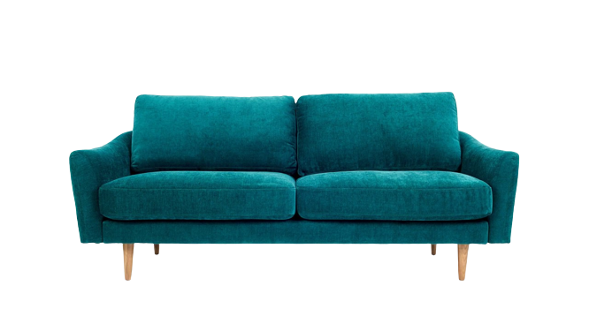
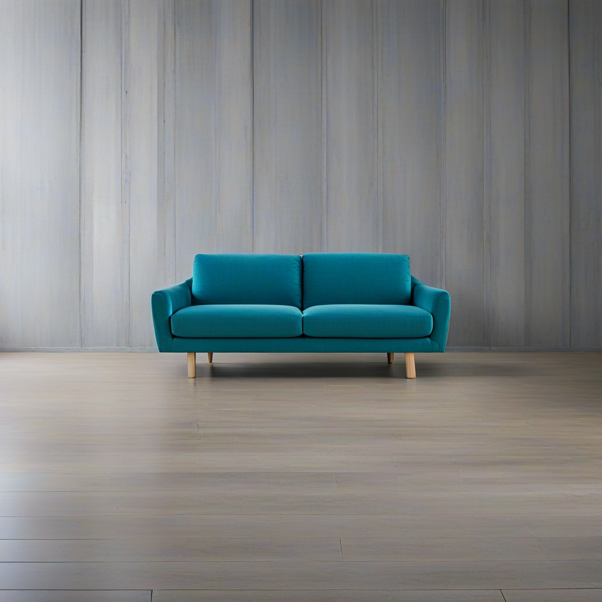

# SDXL-ad-inpaint model

This is a custom implementation of an SDXL Ad Inpaint Cog model. [Cog packages machine learning models as standard containers.](https://github.com/replicate/cog)

First, download the pre-trained weights:

    cog run script/download-weights

Then, you can run predictions:

    cog predict -i image=@sofa.jpg -i prompt="a modern sofa in a contemporary living room, stylish decor"

## Example

Input image

Output image with background inpainted

